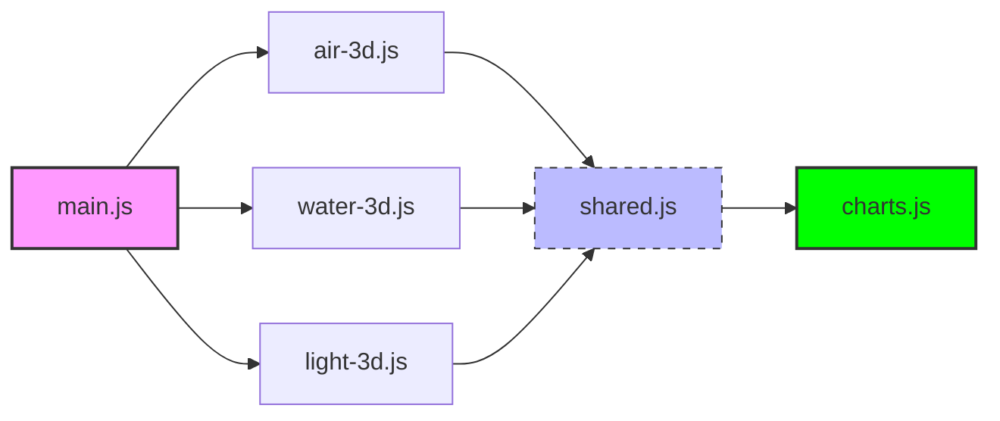

# 🛠️ Development & Customization Guide

This document provides technical instructions for developers looking to modify **EcoPulse**, integrate real-world data, or customize the 3D environment.

---

## 📊 Data Integration

### Using Sample Data
By default, EcoPulse reads from `data/sample-data.json`. This is ideal for local development and offline demonstrations.

### Switching to Live APIs
To transition from static data to real-time environmental APIs, follow these steps:

1. **Locate the Loader:** Open `js/charts.js`.
2. **Modify the Fetch Logic:** Replace the local path with your API endpoint.
```javascript
async loadData() {
    try {
        // 1. Replace with your chosen API endpoint
        const response = await fetch('[https://api.openaq.org/v2/measurements](https://api.openaq.org/v2/measurements)');
        const liveData = await response.json();
        
        // 2. Map the API response to EcoPulse format
        this.data = this.transformData(liveData);
        this.initializeCharts();
    } catch (error) {
        console.error('API integration failed, falling back to local data:', error);
```

### 🌐 Recommended APIs
To replace the static sample data with live environmental metrics, we recommend integrating the following open-source data providers:

* **🌬️ Air Quality:** [OpenAQ API](https://openaq.org/) — Provides real-time and historical particulate matter data globally.
* **💧 Water Quality:** [USGS Water Services](https://waterservices.usgs.gov/) — Access to instantaneous values for water temperature, pH, and conductivity.
* **🌌 Light Pollution:** [Globe at Night Data](https://www.globeatnight.org/) — Community-sourced data for night sky brightness and visibility.

---

## 🎨 3D Customization & Shaders

EcoPulse uses **Three.js** to render its environments. You can customize the look and feel of these scenes easily to match different environmental themes.

### Adjusting Visual Theme
Edit the `:root` variables in `css/styles.css` to change the global "Eco" aesthetic across the entire application:
```css
:root {
    --eco-green: #10b981; /* Primary brand color */
    --eco-alert: #ef4444; /* High pollution warning color */
}
        this.loadFallbackData();
    }
}
```

### Modifying 3D Particle Intensity
In js/air-3d.js (and similar scene files), you can adjust the particle simulation density to match different data sensitivities or performance requirements:
```javaScript
// Increase the multiplier (e.g., * 20) for a more dense smog effect
const particleCount = Math.floor(this.pollutionLevel * 15);
```

---

## 🏗️ Project Architecture
EcoPulse is built with a modular "Scene-per-Page" architecture to keep the WebGL context clean and optimize memory usage.



---

## 🧪 Testing Your Changes

Before submitting a Pull Request, please ensure your changes meet the following criteria to maintain project quality:

* **🧹 Linting:** We follow standard **ES6 practices**. Ensure your code is clean, well-commented, and free of syntax errors or console warnings.
* **🚀 Performance:** Open the **Chrome DevTools Performance tab** and record a session while interacting with the 3D scenes. Ensure the frame rate consistently stays **above 50 FPS**.
    
* **📱 Responsive Check:** Use the **"Device Toggle"** (Ctrl+Shift+M) in your browser to verify that the UI, sliders, and 3D canvases scale correctly across mobile, tablet, and desktop breakpoints.
    

---

[← Back to Main README](../README.md)
